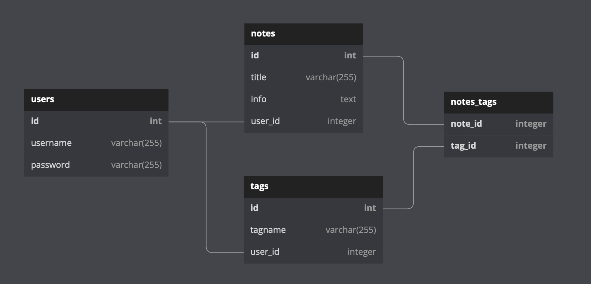
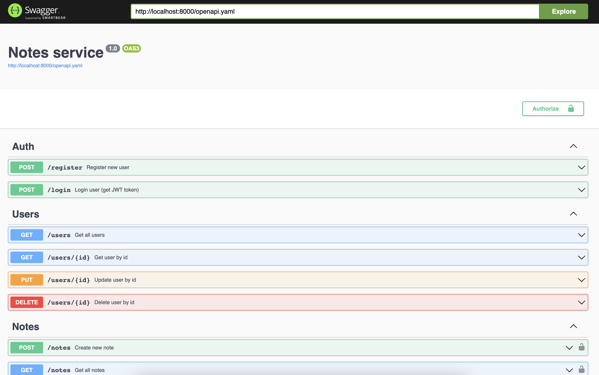

## Project description
The service allows you to create notes and attach tags to them.
The functionality of the service is very simple, there are 3 entities:
- user
- note
- tag

You can create a user, authorize him, create notes and attach tags to these notes.
JWT token authorization is used here.

The project is made using the principles of clean architecture.

The project consists of 3 microservices and each runs in a container with docker-compose:
1. Nginx
2. Go-service
3. PostgreSQL

## Start
To start the service run the command in the terminal. This command will launch all the services containers (nginx, app, database) and make db migrations:
```bash
make dockerup
```

To stop, run the command:
```bash
make dockerstop
```

## DB Migrations
For manual migration settings macOS users need to run a command in the terminal to install this software:
```bash
brew install golang-migrate
```
Creating migration files:
```bash
make migrate-create
```
Applying migration files:
```bash
make migrate-up
```
Rollback to the previous version of the migration:
```bash
make migrate-down
```

## Unit-tests
To run the `unit tests`, run the command:
```bash
make test
```

## Linter
MacOS users need to run a command in the terminal to install this software:
```bash
brew install golangci-lint
```
All the checks can be found in the file `.golangci.yml`.

To run the check, run the command in the terminal:
```bash
make lint
```

## ER Diagram
<p align="left">
    
</p>

## Swagger
`Swagger` available at the link: http://localhost:8000/swagger
<p align="left">
    
</p>